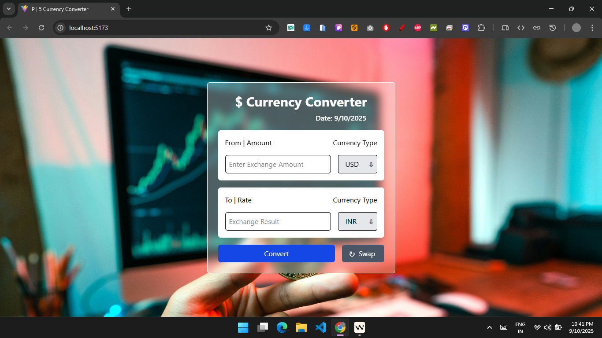

# $ Currency Converter

A sleek and simple **Currency Converter** web app built with **React** and **Tailwind CSS**.
Convert currencies easily with live exchange rates and a smooth user experience.

---

## 📸 Screenshot



---

## ✨ Features

- Convert between multiple currencies in real-time
- Swap "From" and "To" currencies with one click
- Loading skeleton for smooth UX
- Clean, responsive, and modern UI

---

## 🛠 Tech Stack

- **React.js** – Frontend framework
- **Tailwind CSS** – Styling and layout
- **Axios** – API requests
- **Open Exchange Rates API** – Live currency rates

---

## 🚀 Getting Started

1. **Clone the repository**

```bash
git clone https://github.com/md-sonu07/react-learning-repo.git

```

2. **Navigate to the project folder**

```bash
cd 01. Currency Exchange
```

3. **Install dependencies**

```bash
npm install
```

4. **Start the app**

```bash
npm start
```

5. Open [http://localhost:3000](http://localhost:3000) in your browser

---
