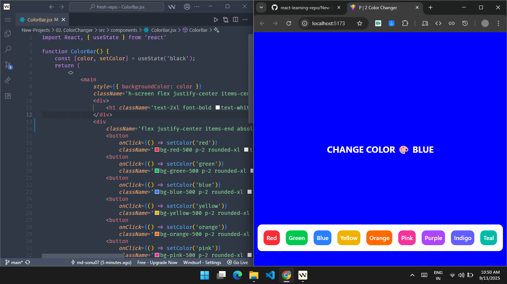

# 🎨 Background Color Changer

A fun and interactive **Background Color Changer** web app built with **React** and **Tailwind CSS**.  
Click the color buttons at the bottom to instantly change the background color of the page!  

---

## 📸 Screenshot



---

## ✨ Features

- Click buttons to change background color  
- Shows the current selected color name (UPPERCASE) on screen  
- Smooth hover and transition effects  
- Modern, minimal UI with Tailwind CSS  

---

## 🛠 Tech Stack

- **React.js** – Frontend framework  
- **Tailwind CSS** – Styling and layout  

---

## 🚀 Getting Started

1. **Clone the repository**

```bash
git clone https://github.com/md-sonu07/react-learning-repo.git
````

2. **Navigate to the project folder**

```bash
cd 02. Bg Changer
```

3. **Install dependencies**

```bash
npm install
```

4. **Start the app**

```bash
npm run dev
```

5. Open [http://localhost:5173](http://localhost:5173) in your browser

---
