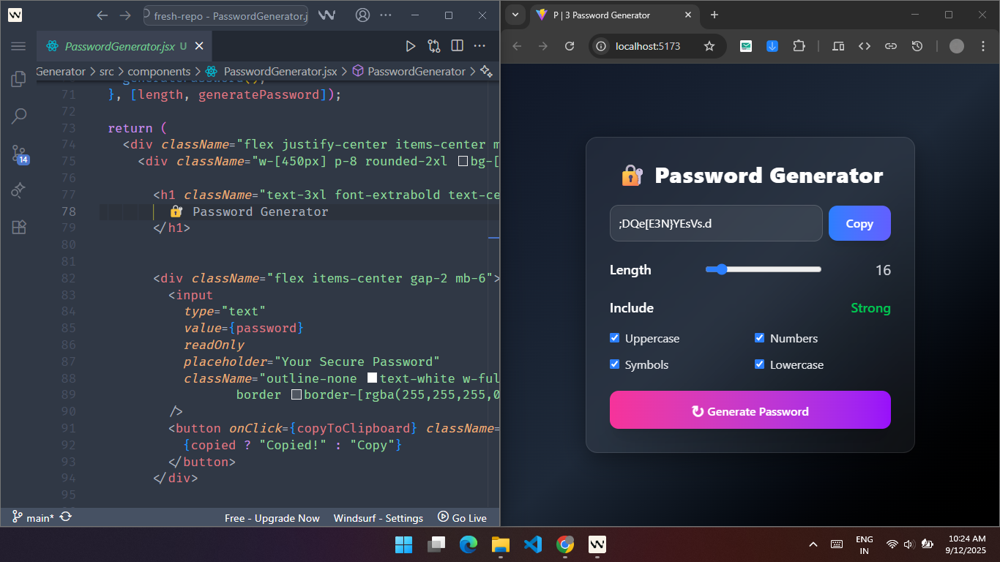

# 🔐 Password Generator

A modern and secure **Password Generator** built with **React & Tailwind CSS**.
Easily generate strong passwords with customizable options like length, uppercase, lowercase, numbers, and symbols.

---

## 📸 Screenshot



---

## ✨ Features

* Generate secure passwords instantly
* Copy password to clipboard with one click
* Customize password length (6–100)
* Options to include **uppercase, lowercase, numbers, and symbols**
* Password strength indicator (Weak → Strong)
* Clean glassmorphism design with smooth transitions

---

## 🛠 Tech Stack

* **React.js** – Frontend framework
* **Tailwind CSS** – Styling & UI
* **JavaScript** – Core password logic

---

## 🚀 Getting Started

1. **Clone the repository**

```bash
git clone https://github.com/md-sonu07/react-learning-repo.git
```

2. **Navigate to the project folder**

```bash
cd 03. Password Generator
```

3. **Install dependencies**

```bash
npm install
```

4. **Start the app**

```bash
npm start
```

5. Open [http://localhost:3000](http://localhost:3000) in your browser 🎉
