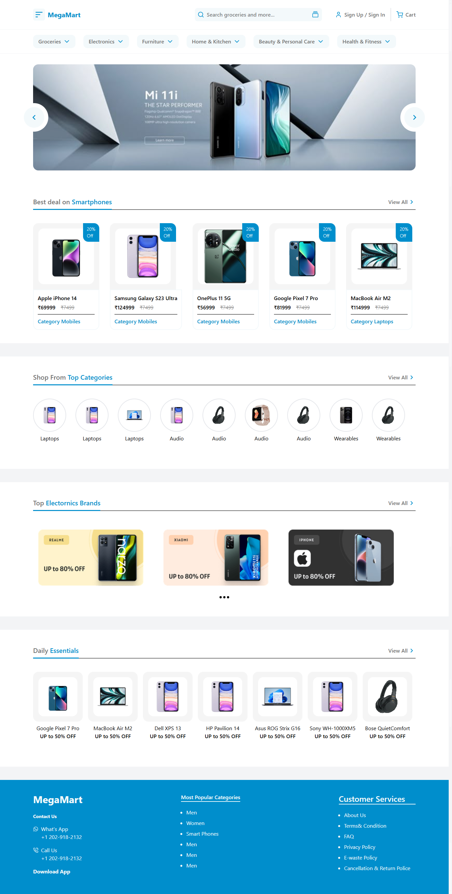
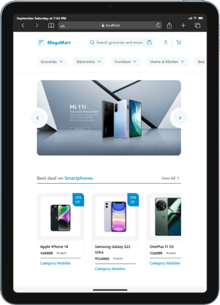
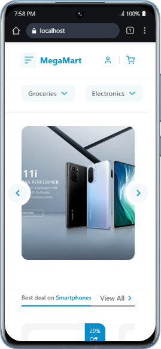

# 🛍️ MegaMart

### A modern and fully **responsive E-Commerce Website** built with **React + Tailwind CSS**, using **JSON data** for product listings.  
### Currently improving the design and adding more features! 🚀  

---

## ✨ Features
- 📦 Product listings powered by JSON data  
- 🎨 Clean and **fully responsive UI** (React + Tailwind CSS)  
- 🔍 Easy-to-navigate product cards  
- ⚡ Fast and lightweight frontend  

---

## 🖼️ Screenshot




# Desktop


# Mobile & Tablet
<p align="center" style="display: flex; justify-content: center; gap: 10px; ">
    
    
</p>

---

## 🛠️ Tech Stack
- **React.js** ⚛️  
- **Tailwind CSS** 🎨  
- **JSON (for product data)**  

---

## 🚀 Getting Started

### 1️⃣ Clone the Repository
```bash
git clone https://github.com/md-sonu07/react-learning-repo.git
cd 04. MegaMart
```

### 2️⃣ Install Dependencies

```bash
npm install
```

### 3️⃣ Run the App

```bash
npm run dev
```

### 4️⃣ Open 
 [http://localhost:5173](http://localhost:5173) in your browser🎉

