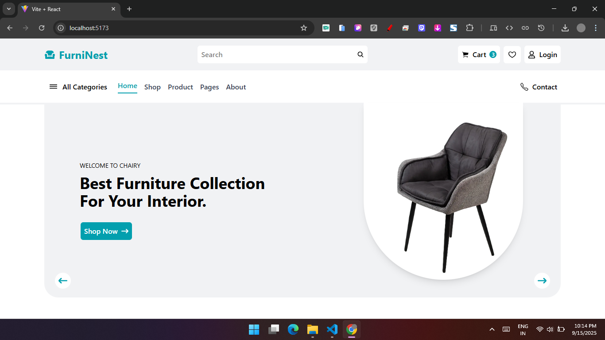

# 🛒 FurniNest - E-Commerce Website

FurniNest is a modern, fully responsive **E-Commerce web app** built with **React.js + Tailwind CSS**.  
It comes with smooth navigation, authentication,  and a clean premium UI design.  

---

## 🚀 Features

### 🔑 Authentication
- **Clerk Authentication** (Sign up, Login, Secure User Sessions)
- User Profile & Account Management
- Persistent Login (Stay signed in)


### 🎨 UI / UX
- Modern **Glassmorphism + Tailwind** design
- Fully responsive (Desktop, Tablet, Mobile)
- Clean Cards UI for Products

### 📦 Pages Included
- 🏠 Home Page  
- 🛒 Products Page  
- 📂 All Categories Page (Detailed)  
- ❤️ Wishlist Page  
- 🛍️ Cart Page  
- 👤 User Profile Page  
- 🔐 Authentication Pages (Login, Register via Clerk)  
- ❌ 404 - Page Not Found  

---

## 🛠️ Tech Stack
- **React.js** (Frontend)  
- **Tailwind CSS** (Styling)  
- **Clerk** (Authentication)  
- **React Router DOM** (Navigation)  
- **React Icons** (Icons)  

---

## 📸 Screenshots


---

## ⚡ How to Run Locally
```bash
# Clone the repo
git clone https://github.com/md-sonu07/react-learning-repo.git
cd 05. FurniNest

# Install dependencies
npm install

# Start development server
npm run dev
